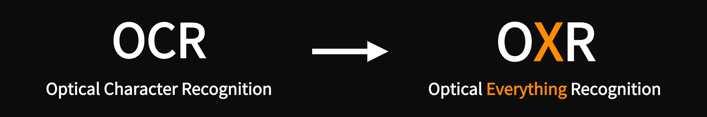

# SoMark｜OXR

**English** · [简体中文](README_CN.md)

An open-source document parsing model with SOTA accuracy and speed.

---

Turn documents into Agent-Friendly data.

OXR (Optical Everything Recognition) is an open-source model from the SoMark team. It turns PDFs and document images into Agent-Friendly data in Markdown or JSON, with layout coordinates included.

OXR is the first to make its layout analysis module independent and pluggable. This design accelerates parsing and supports replacing the built-in layout model with a custom one. OXR continues to handle content recognition and reading order, enabling adaptation across diverse scenarios with minimal integration effort.

---

> If this project helps you, please click the ⭐ Star in the top right corner — it's the greatest encouragement for the developers!

## License

OXR is licensed under a custom license based on Apache 2.0, with additional terms.

If you need further services, contact the SoMark team → [somark.ai](https://somark.ai/)
